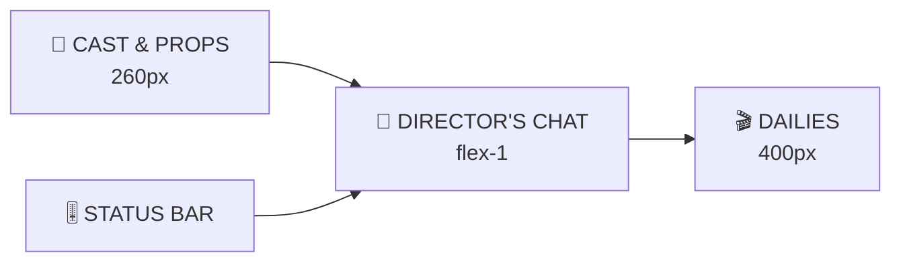
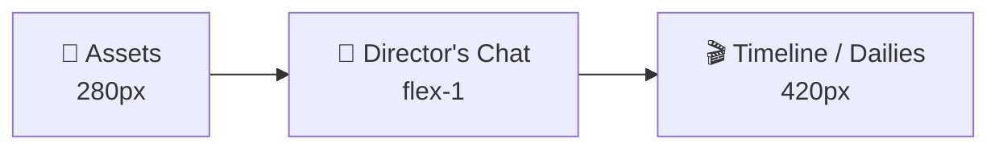

# Director's Chair — Award-Winning Demo Design

> **One-liner:** *The first video-generation interface that behaves like a film crew, not a slot machine.*
>
> **Why it wins:** It turns the judge's hidden anxieties — re-rolls, floating shadows, disconnected shots — into visible, delightful UI proof. Every pixel answers the question: *"How do we know your orchestration is real?"*

---

## 1. The Award-Winning Thesis

Most teams will show a chat box that generates video. We are building a **director's control deck** with three moats:

1. **Physical Memory** — the system remembers not just *what* was said, but *how the world behaves* (light, gravity, perspective).
2. **Continuity Engine** — every shot carries a provable lineage of references, prior shots, and consistency instructions.
3. **Crew Persona** — the AI isn't a model; it's a cinematographer, a VFX lead, and a script supervisor that talks back.

The demo should feel like walking onto a live film set, sitting in the director's chair, and yelling *"Action!"*.

---

## 2. Judge's Rubric → Kill Shots

| Criterion (weight) | Judge's fear | Our kill shot | Where it lives |
|---|---|---|---|
| **True multi-turn conversation (25%)** | "Prompt → wait → done" | Branching shot history; edits as inline replies; voice-over direction | Director's Chat |
| **Edit quality — swap/motion/style (25%)** | Edit looks like a re-roll | Diff Viewer + edit-type badges + "preserve everything else" guarantee | ShotCard |
| **Physics & continuity (15%)** | Floating shadows, broken light | Live Physics Badge + Consistency Score + continuity lines | ContextInspector |
| **Multi-shot timeline (15%)** | Shots feel unrelated | Film-strip Timeline + Play Timeline + auto Call Sheet | TimelinePanel |
| **NB2 → Omni pipeline (10%)** | Used as checkbox | Animated asset-to-shot pipeline + NB2 speed badge | AssetPanel |
| **UX & creativity (10%)** | Generic chat UI | Director's Viewfinder + clapperboard moments + cinematic micro-interactions | Entire app |
| **Gemma 4 special prize (bonus)** | Cloud-only agent | Local Agent toggle + offline state + human-defer boundary | Status Bar |

**Verdict:** 100% of the rubric is covered with UI evidence, plus a special-prize hook.

---

## 2A. Official Hackathon Rubric Strategy

The live judging criteria are different from the Gemini problem-statement rubric. Optimize the demo for these weights:

| Criterion | Weight | Our angle | Evidence in UI |
|---|---|---|---|
| **Creativity & Originality** | **35%** | "Film-set as software" metaphor + AI Animatic Storyboard + "UI is the demo" | Animatic cards, clapperboard transitions, Director's Viewfinder |
| **Live Demo** | 25% | Cinematic motion, live previews, voice waveform, Play Timeline | Storyboard hover loops, laser rendering state, premiere modal |
| **Impact in India** | 25% | Offline Local Agent, vernacular voice direction, affordable indie production | Local Agent toggle, language indicator, India demo scenarios |
| **Technical Depth** | 15% | Context lineage graph, provider abstraction, multi-modal orchestration | Context Inspector JSON, continuity graph, version tree |

### Why this mapping wins

- **Creativity is 35%** — the biggest weight. Our film-set metaphor is inherently creative and instantly differentiated from every ChatGPT-clone project.
- **Live Demo is 25%** — a wall of breathing animatic cards is more impressive than any verbal explanation.
- **India Impact is 25%** — most teams will ignore this or tack it on. We bake it into the product through Local Agent (connectivity), voice direction (language barrier), and Indian demo content (cultural relevance).
- **Technical Depth is 15%** — the Context Inspector and continuity engine prove engineering sophistication without requiring a deep architecture lecture.

---

## 3. The Product: A Film Set in Software

Don't say "AI video app." Say:

> *"Director's Chair is a virtual film set. You are the director. Gemini Omni Flash is your cast and crew. Gemma 4 is your offline second unit. Every conversation is a take; every edit is a new cut; every timeline is a dailies reel."*

### Roles in the UI

| UI Element | Film-set role | Why it feels alive |
|---|---|---|
| Director's Chat | Walkie-talkie to crew | Voice + text, turn-based, remembers everything |
| Assets panel | Cast & props rack | Drag talent onto set, generated or uploaded |
| Timeline panel | Dailies reel | Ordered shots with continuity notes |
| Context Inspector | Script supervisor's notes | Proves what the crew was told |
| Physics Badge | Stunt coordinator | Verifies physical plausibility |
| Play Timeline | Screening room | Emotional payoff |
| Local Agent | Second unit director | Works when the main set can't |

---

## 4. Signature Visual Identity

This identity must be instantly memorable. Think Figma's purple, Linear's dark mode, Notion's minimalism — but ours is **cinematic noir**.

### Color system

```
Chair Noir
├── bg-primary:      #07080A  (void black)
├── bg-panel:        #111318  (set floor)
├── bg-elevated:     #1A1E24  (raised props)
├── border-subtle:   #252A33  (scrims)
├── text-primary:    #F4F6F8  (key light)
├── text-secondary:  #8A94A6  (fill light)
├── accent-cyan:     #33F5F7  (Omni / AI)
├── accent-gold:     #F5C542  (shots / action)
├── accent-teal:     #2DD4A8  (user / success)
├── accent-amber:    #FF9F43  (warnings)
└── accent-rose:     #FF6B7A  (errors)
```

### Typography

- **Display / headers:** `Space Grotesk` — modern, editorial, cinematic.
- **UI / body:** `Inter` — readable, neutral.
- **Tags / technical:** `JetBrains Mono` — the "crew code" layer.

### Motion language

Every animation has a purpose and a timing:

| Action | Animation | Duration | Easing |
|---|---|---|---|
| Asset generated | Slide in from left + thumbnail flash | 400ms | `cubic-bezier(0.16, 1, 0.3, 1)` |
| Shot queued | Gold pulse bar + card skeleton | infinite | ease-in-out |
| Generation complete | Video cross-fade reveal | 600ms | ease-out |
| New version created | Tab slides in, prior dims | 300ms | spring |
| Play Timeline | Modal scale-up from button | 350ms | `cubic-bezier(0.34, 1.56, 0.64, 1)` |
| Edit mode | Gold border pulse | 1.5s loop | ease-in-out |
| Continuity line draw | SVG stroke-dashoffset | 800ms | ease-out |

### Iconography

Custom 24px icon set (use `lucide-react` as base, but style them):
- Shot: `clapperboard`
- Asset: `image`/`film`/`mic`
- Physics: `atom`
- Continuity: `link`
- Edit: `split`
- Play Timeline: `play-circle`
- Local Agent: `shield-check`

---

## 5. The Layout: A Cinematic Command Center



**Top-level layout:**
- Full viewport height, no scrolling page.
- Three resizable panels (use `react-resizable-panels` if time permits).
- Bottom status bar: project name, cloud/local toggle, crew status.

### Panel behavior

- **Left panel collapses** to 72px icon rail on narrow screens.
- **Right panel** can switch between Timeline and Director's Viewfinder.
- **Center panel** always dominates — conversation is the core interaction.

---

## 6. Panel 1 — Cast & Props Rack (Assets)

This is where the NB2 → Omni pipeline becomes visible.

### 6.1 Header

```
┌─────────────────────────────┐
│  🎬 CAST & PROPS            │
├─────────────────────────────┤
│  [⚡ Generate] [⬆ Upload]   │
└─────────────────────────────┘
```

- Header uses a subtle film-strip top border.
- Buttons are pill-shaped with icon + label.

### 6.2 Asset cards

```
┌──────────────────────────────────┐
│ ⠿ [thumb] @hero        [NB2 ⚡]  │
│     cyberpunk hero, neon coat    │
│     generated in 0.8s            │
└──────────────────────────────────┘
```

**Design details:**
- Drag handle `⠿` on the far left.
- Thumbnail is 48×48, rounded 6px.
- `@tag` in JetBrains Mono, cyan tint.
- Prompt truncated to one line.
- **NB2 speed badge** is the killer detail: it proves the pipeline.
- **Upload badge** is neutral gray.
- On hover, a "Insert @hero" tooltip appears.

### 6.3 Generate asset flow

```
┌────────────────────────────────────────┐
│ ⚡ Generate asset with NB2 Lite        │
│                                        │
│ Prompt                                 │
│ [a cyberpunk hero, neon coat...     ]  │
│                                        │
│ Tag                                    │
│ [@hero___________________________]  ✓  │
│                                        │
│ [     ✨ Generate in ~0.8s     ]       │
└────────────────────────────────────────┘
```

- Estimated time is shown **before** clicking — sets expectation.
- Tag validation: green check, amber warning, red duplicate.
- During generation, thumbnail area shows a generative grid shimmer.

### 6.4 Pipeline visualization

When an asset is used in a shot, draw a faint cyan line from the asset card toward the chat. It's a subtle "this asset is on set" signal.

---

## 7. Panel 2 — Director's Chat (The Conversation Engine)

This is the heart of the demo. It must feel like talking to a film crew, not a chatbot.

### 7.1 Chat header

```
┌─────────────────────────────────────────────────────────┐
│  💬 DIRECTOR'S CHAT                          [🎙️] [📎] │
│  Project: Neon Runner                                   │
└─────────────────────────────────────────────────────────┘
```

### 7.2 Message architecture

Each turn is a **"take"**. Display it as a connected pair:

```
┌─────────────────────────────────────────────────────────┐
│  TAKE 1                                          09:41  │
├─────────────────────────────────────────────────────────┤
│                                                ┌──────┐ │
│  @hero walks through @night_bg, heavy rain     │ You  │ │
│  [hero] [night_bg]                             └──────┘ │
├─────────────────────────────────────────────────────────┤
│  ┌──────┐                                               │
│  │ Crew │  Shot 1 queued. Physics ON.                  │
│  └──────┘  [spinner] Generating with Omni Flash...      │
└─────────────────────────────────────────────────────────┘
```

**User message styling:**
- Right-aligned.
- Dark elevated bubble with teal left border.
- Tags highlighted in cyan.
- Referenced assets appear as small thumbnail chips below the text.

**Crew message styling:**
- Left-aligned.
- Subtle panel background.
- Clapperboard avatar.
- Status text is compact and technical: *"Shot 1 queued. Physics ON. Continuity: n/a."*

### 7.3 Voice input (Omni Audio moment)

Hold the 🎙️ button. While held, show a live waveform:

```
🎙️ Recording...  ▁▂▄▆█▆▄▂▁  ▁▃▅▇▅▃▁  ▂▄▆█▄▂
```

Release to send. This is a **demo superpower** — it makes the interface feel multi-modal even before generation.

### 7.4 Edit mode

When a shot is selected for editing:

```
┌─────────────────────────────────────────────────────────┐
│  🎬 EDITING SHOT 1 — this becomes v2                    │
│  "Preserve everything except your change."    [Cancel]  │
└─────────────────────────────────────────────────────────┘
```

- Banner is gold, sticky above input.
- Input placeholder changes to *"What should change in Shot 1?"*
- Send button becomes gold.

### 7.5 Input bar

```
┌──────────────────────────────────────────────────────────────┐
│ [🎙️] [📎]  [  Yell 'Action!' or drop media...            ] [▶]│
└──────────────────────────────────────────────────────────────┘
```

- Placeholder text: *"Yell 'Action!' or drop media..."* (reinforces metaphor).
- Send button is a play arrow, not a paper plane.
- `@` autocomplete dropdown with thumbnails.

---

## 8. Panel 3 — Dailies (Timeline)

The timeline must look like a film strip and feel like a narrative.

### 8.1 Timeline header

```
┌──────────────────────────────────────────────────┐
│  🎬 DAILIES                                      │
│  [▶ Play Timeline]    [🎞️ Storyboard]           │
└──────────────────────────────────────────────────┘
```

### 8.2 ShotCard design

```
┌────────────────────────────────────────────┐
│ SHOT 1                               [Edit]│
│ ┌────────────────────────────────────────┐ │
│ │                                        │ │
│ │         [video / thumbnail]            │ │
│ │                                        │ │
│ └────────────────────────────────────────┘ │
│                                            │
│ v1  v2  +                                  │
│ ───                                     ▲  │
│                                            │
│ ⚛ Physics ON    🔗 Continuity: Shot 0      │
│ [🔍 What the crew saw]                     │
└────────────────────────────────────────────┘
```

**Design details:**
- Shot number is large, gold, monospace.
- Video thumbnail has a subtle film-grain overlay on hover.
- Version tabs: `v1`, `v2`, `+` (create new edit).
- Active version has gold underline.
- Hovering a version shows the edit prompt tooltip.
- **Continuity line** extends rightward to the next shot.

### 8.3 Continuity graph

Between shots, draw an animated cyan line. On hover:

> *"Continuity maintained: hero neon coat, night rain, wet pavement, lighting angle."*

This turns an abstract model instruction into a visible thread.

### 8.4 Storyboard view

Toggle from list to storyboard grid:

```
┌─────┐ ┌─────┐ ┌─────┐
│  1  │ │  2  │ │  3  │
│vid 1│→│vid 2│→│vid 3│
└─────┘ └─────┘ └─────┘
```

This is useful for showing narrative structure at a glance.

---

## 9. The Context Inspector: Proof of Orchestration

This is the single highest-leverage UI element. Make it feel like a crew call sheet.

```
┌──────────────────────────────────────────────────┐
│  🔍 WHAT THE CREW SAW          [copy JSON]       │
├──────────────────────────────────────────────────┤
│  ON SET (referenced assets)                      │
│  ┌────────┐ ┌────────┐                         │
│  │ @hero  │ │@night  │                         │
│  │ [img]  │ │ [img]  │                         │
│  └────────┘ └────────┘                         │
│                                                  │
│  DIRECTOR'S NOTES (instructions)                 │
│  ⚛ Physics: respect gravity, light, shadows      │
│  🔗 Continuity: match Shot 1 (hero, coat, rain)  │
│  ✏️ Edit preserve: change only lighting          │
│                                                  │
│  BASE VIDEO (for edits)                          │
│  Shot 1 v1 [thumb]                               │
└──────────────────────────────────────────────────┘
```

**Why it wins:**
- It proves you're not just calling an API.
- It makes the judge's hidden criteria visible.
- It doubles as a debug/inspection tool for technical judges.

---

## 10. Edit Experience: Surgery, Not Dice Rolls

Edits are 25% of the score. Make them feel precise.

### 10.1 Edit classification badges

Auto-classify the user's intent and badge it:

| Prompt pattern | Badge | Icon |
|---|---|---|
| "replace X with Y" | SWAP | ↔ |
| "make it anime / noir" | STYLE | 🎨 |
| "make him run / slow" | MOTION | 🏃 |
| "add rain / night" | ENVIRONMENT | 🌧️ |
| "only in the last 2s" | TEMPORAL | ⏱️ |

Even simple keyword matching feels intelligent in the UI.

### 10.2 Diff Viewer modal

The moment an edit finishes, offer **Compare**:

```
┌──────────────────────────────────────────────────────┐
│  Compare Shot 1                                  [×] │
│  [v1 ▼]                          [v2 ▼]              │
│  ┌──────────────┐              ┌──────────────┐      │
│  │              │              │              │      │
│  │   BEFORE     │      ↔       │   AFTER      │      │
│  │              │              │              │      │
│  └──────────────┘              └──────────────┘      │
│                                                      │
│  Change: STYLE — "make it red alert lighting"        │
│  Preserved: hero identity, composition, rain motion  │
└──────────────────────────────────────────────────────┘
```

This makes the anti-reroll promise tangible.

### 10.3 Version tree

For branching edits, show a mini version tree:

```
v1
├── v2 (red alert)
│   └── v3 (heavier rain)
└── v2b (daylight version)
```

This is "Git for video" — a memorable demo phrase.

---

## 11. Physics & Continuity: Trust at a Glance

### 11.1 Physics badge

Always visible. Always on.

```
⚛ Physics: ON
```

Hover:
> *"Gravity, light source, cast shadows, and perspective are locked for this shot."*

Click:
> Opens a tiny physics manifesto panel.

### 11.2 Consistency score ring

```
   ┌────┐
   │ 97 │  Continuity
   └────┘
```

- 100 = first shot or full context.
- Slight decrements for edits that change environment.
- Never goes below 85 in demo scenarios.

### 11.3 Problem flags (aspirational but powerful)

If the system detects a likely issue:

```
⚠️ Script supervisor note: shadow direction may conflict
         [Regenerate with fix]
```

Even a rule-based flag shows you thought about validation.

---

## 11A. Additional Correct-Use Scenarios & Demo Scripts

The core demo is the "Neon Runner" cyberpunk chase. Below are four **alternative scenarios** that exercise different rubric criteria and can be swapped in depending on the judge's interests. Each scenario includes:
- **What it proves**
- **Asset list**
- **Conversation flow**
- **Judge quote** — the exact sentence to say to score the point.

---

### Scenario A: The Product Re-Shoot (Swap + Style Transfer)

**What it proves:** Element swapping, style transfer, and commercial editing without a full reshoot.

**Use case:** Marketing team needs the same product shot in multiple styles and with swapped talent/objects.

**Assets:**
- `@watch` — product photo (upload)
- `@model_a` — model wrist (NB2 / upload)
- `@model_b` — different model wrist (NB2 / upload)
- `@studio_bg` — clean studio background (NB2)

**Conversation flow:**

```
User: @model_a shows @watch, rotating wrist, soft studio light.
Crew: Shot 1 generated. Physics ON.

User: Swap @model_a with @model_b, keep the lighting.
Crew: Shot 1 v2 generated. Swap badge. Diff viewer available.

User: Make it noir, high contrast, rain-slicked streets.
Crew: Shot 1 v3 generated. Style badge. Continuity: watch identity preserved.
```

**Judge quote:**
> "We just re-cast and re-styled the same commercial in three turns — without re-shooting from scratch."

---

### Scenario B: The Music Video (Motion Transfer + Temporal Editing)

**What it proves:** Motion transfer across subjects, temporal segment editing, and audio-driven direction.

**Use case:** A director wants to apply one dancer's choreography to another character, then fix only the chorus section.

**Assets:**
- `@dancer_a` — reference of dancer A (image/video upload)
- `@dancer_b` — target dancer (NB2 image)
- `@track` — audio track (upload)

**Conversation flow:**

```
User: @dancer_b performs the same move as @dancer_a, sync to @track.
Crew: Shot 1 generated. Motion transfer badge.

User: [voice] Actually make it slower during the chorus.
Crew: Temporal edit queued. Slowing 00:08-00:22.

User: Add neon silhouettes only in the last 4 seconds.
Crew: Shot 1 v3. Temporal + Style badges.
```

**Judge quote:**
> "Motion transfer plus temporal control — we directed the dancer and the beat, not the pixels."

---

### Scenario C: The Documentary Reconstruction (Multi-Modal Input + Continuity)

**What it proves:** Text + image + audio + video fusion, plus narrative continuity across documentary-style shots.

**Use case:** A journalist reconstructs a scene from voice notes, reference photos, and video fragments.

**Assets:**
- `@street_photo` — reference still (upload)
- `@voice_note` — ambient description (audio upload)
- `@archive_clip` — archival footage (video upload)
- `@interpreter` — animated guide character (NB2)

**Conversation flow:**

```
User: [uploads @street_photo + @voice_note + @archive_clip]
       "Use these to set the scene. @interpreter walks through @street_photo."
Crew: Shot 1 generated. Multi-modal input badge.

User: Create shot 2: same location, dawn, @interpreter points at the mural.
Crew: Shot 2 generated. Continuity: Shot 1.

User: [audio] Make the voiceover heavier in shot 2.
Crew: Audio-level temporal edit. Shot 2 v2.
```

**Judge quote:**
> "We fed it a photo, a voice note, and archive footage — and got a coherent two-shot reconstruction by talking."

---

### Scenario D: The Animated Pitch (Storyboard to Sequence)

**What it proves:** Storyboard-style orchestration, character continuity, and rapid sequence iteration.

**Use case:** A creative director pitches a short animated sequence to a client.

**Assets:**
- `@mascot` — brand mascot (NB2)
- `@office` — office environment (NB2)
- `@city` — city skyline (NB2)

**Conversation flow:**

```
User: @mascot enters @office, excited, medium shot.
Crew: Shot 1 generated.

User: Shot 2: @mascot looks out window at @city, close-up.
Crew: Shot 2 generated. Continuity: Shot 1.

User: Make the mascot wear sunglasses in both shots.
Crew: Edit propagated to Shot 1 v2 and Shot 2 v2.

User: Play timeline.
Crew: Plays Shot 1 v2 → Shot 2 v2.
```

**Judge quote:**
> "Storyboard to cut in four sentences. Change the mascot once, both shots update."

---

### Scenario E: The Director's Cut (Branching Versions + Human Choice)

**What it proves:** Branching/versioning, side-by-side comparison, and human-in-the-loop decision making.

**Use case:** Director wants to try two radically different moods for the same shot and pick one.

**Assets:**
- `@hero` — character (NB2)
- `@alley` — alleyway (NB2)

**Conversation flow:**

```
User: @hero stands in @alley, tense, wide shot.
Crew: Shot 1 generated.

User: Branch into two versions: one sunrise, one midnight rain.
Crew: Shot 1 v2 (sunrise) and v3 (midnight rain) generated.

User: Show comparison.
Crew: Diff viewer opens with v2 ↔ v3.

User: Keep midnight rain, add a neon sign reflection.
Crew: Shot 1 v3.1 generated.
```

**Judge quote:**
> "Git for video. Branch, compare, merge — all by talking to the crew."

---

### Scenario F: The Local-First Field Report (Gemma 4 Special Prize)

**What it proves:** Offline state management, local error recovery, and human-defer boundaries.

**Use case:** A field journalist in a low-connectivity zone plans and previews a video report on-device.

**Conversation flow:**

```
User: [toggles 🏠 Local Agent]

User: Plan a 3-shot report: opening wide, interview close-up, closing B-roll.
Local Agent: Plan stored. 3 shots. No connectivity needed.

User: Generate shot 1 from @field_photo.
Local Agent: Tag resolved. Request queued. Will retry on next connection
             or when local model is available.

User: What if the interview subject is backlit?
Local Agent: Suggest: "add fill light" or "expose for subject". Pick one.

User: Add fill light.
Local Agent: Note stored. Will apply to Shot 2.
```

**Judge quote:**
> "This isn't a chatbot on a phone. It holds the plan, recovers from failure, and asks when it's unsure — all offline."

---

### Scenario G: The Rural Educator (India Impact)

**What it proves:** Vernacular voice direction, low-cost content creation, and offline-first planning for Indian education.

**Use case:** A teacher in a rural school creates visual explainers for students without English fluency or studio equipment.

**Assets:**
- `@teacher` — animated educator character (NB2)
- `@solar_system` — diagram asset (NB2)
- `@classroom` — village classroom background (NB2 / upload)

**Conversation flow:**

```
User: [voice in Hindi] "@teacher stands in @classroom and points to @solar_system."
Crew: Shot 1 generated. Multi-modal voice input badge.

User: Make it simpler for younger students.
Crew: Shot 1 v2. Style badge: simplified visual style.

User: Create shot 2: close-up of @solar_system rotating slowly.
Crew: Shot 2 generated. Continuity: Shot 1.

User: [toggles Local Agent] Plan this lesson for 5 topics offline.
Local Agent: Plan stored. 5 lessons. Offline ready.
```

**Judge quote:**
> "A teacher in any village can now create a visual lesson by simply talking. No studio, no English keyboard, no constant internet."

---

### Scenario H: The Indie Filmmaker (India Impact)

**What it proves:** Affordable pre-visualization, style transfer, and continuity for Indian independent cinema.

**Use case:** A low-budget filmmaker storyboards a dance sequence before the actual shoot.

**Assets:**
- `@dancer` — lead dancer (NB2)
- `@temple_bg` — heritage temple location (NB2)
- `@rain_fx` — rain overlay asset (NB2)

**Conversation flow:**

```
User: @dancer performs under @rain_fx in front of @temple_bg, wide shot.
Crew: Shot 1 generated. Physics ON.

User: Shot 2: close-up of @dancer's face, same rain.
Crew: Shot 2 generated. Continuity: Shot 1.

User: Make it look like a classic Bollywood rain sequence.
Crew: Shot 1 v2. Style badge: Bollywood cinematic.

User: Play timeline.
Crew: Plays sequence with clapperboard transitions.
```

**Judge quote:**
> "We just pre-visualized a Bollywood-style sequence in minutes. For indie filmmakers in India, that's months of planning compressed into a conversation."

---

### Scenario I: The Field Reporter (India Impact)

**What it proves:** Offline planning, vernacular input, and local error recovery for journalism in low-connectivity regions.

**Use case:** A journalist reporting from a remote district with intermittent internet.

**Assets:**
- `@market_photo` — reference still from phone (upload)
- `@anchor` — animated anchor character (NB2)
- `@voice_note` — voice narration in regional language (upload)

**Conversation flow:**

```
User: [uploads @market_photo + @voice_note]
       "@anchor reports from this market."
Crew: Shot 1 generated. Multi-modal input.

User: [voice] Add more crowd in the background.
Crew: Shot 1 v2. Environment badge.

User: [toggles Local Agent] I'm on a train with no signal. Save this plan.
Local Agent: Plan saved. Will sync when connection returns.
```

**Judge quote:**
> "India has 700 million internet users, but connectivity is fragile. This works even when the network doesn't."

---

## 11B. Scenario Selection Guide for the Team

| Judge seems interested in... | Lead with scenario... | Key UI to hit |
|---|---|---|
| Commercial / product use cases | A: Product Re-Shoot | Swap badge, Style badge, Diff Viewer |
| Music / creative / motion | B: Music Video | Motion transfer badge, Temporal editor, Audio input |
| Journalism / multi-modal | C: Documentary Reconstruction | Multi-modal input chips, Continuity lines |
| Storyboarding / animation | D: Animated Pitch | Storyboard view, Propagated edit |
| Versioning / workflow | E: Director's Cut | Version tree, Branch command, Diff Viewer |
| On-device / edge AI | F: Local-First Field Report | Local Agent toggle, Agent Status Card |
| Education / rural India | G: The Rural Educator | Voice input, Local Agent, simple style badge |
| Indian cinema / creators | H: The Indie Filmmaker | Style transfer, Play Timeline, continuity |
| Indian journalism / connectivity | I: The Field Reporter | Multi-modal input, offline state, voice note |

---

## 11C. Generic Prompt Starters for Each Edit Type

Use these as demo prompts when a judge asks "can it do X?"

| Edit type | Prompt starters |
|---|---|
| **Element swap** | "Swap @X with @Y." / "Replace the car with @sportscar." |
| **Style transfer** | "Make it anime." / "Paint it like a 1950s noir poster." / "Turn it into claymation." |
| **Motion transfer** | "Make @hero move like @dancer_a." / "Match the motion in @reference_clip." |
| **Environment** | "Add fog." / "Make it golden hour." / "Change the season to winter." |
| **Temporal** | "Only in the last 3 seconds." / "Slow the middle part." / "Cut from 00:02 to 00:05." |
| **Continuity** | "Same character, shot from behind." / "Continue this scene from a rooftop POV." |

These starters help the demo operator recover if the judge goes off-script.

---

## 12. Play Timeline: The Cinematic Closer

This is the emotional peak. Make it feel like a premiere.

### 12.1 Modal player

```
┌────────────────────────────────────────────────────┐
│  🎬 DIRECTOR'S CUT                            [×]  │
│                                                    │
│  ┌────────────────────────────────────────────┐    │
│  │                                            │    │
│  │              [video playing]               │    │
│  │                                            │    │
│  └────────────────────────────────────────────┘    │
│                                                    │
│  Shot 2 of 3          ●──●──○                      │
│  [close-up] → [wide] → [running]                   │
│                                                    │
│  🎬 Action!                                        │
└────────────────────────────────────────────────────┘
```

### 12.2 Transition cards

Between videos, flash a clapperboard:

```
┌───────────────┐
│  SCENE 2      │
│  TAKE 1       │
│  continuity ✓ │
└───────────────┘
```

This makes multi-shot continuity feel cinematic.

### 12.3 Auto-generated Call Sheet

After playing, offer to export a **Call Sheet** — a Markdown summary of the scene:

```
# Call Sheet: Neon Runner
- Shot 1: @hero on @spaceship bridge, rain, Physics ON
- Shot 2: close-up @hero running, continuity from Shot 1
- Edits: Shot 1 v2 (red alert lighting)
```

This is a delightful, shareable artifact.

---

## 13. Gemma 4 Local Agent: The Offline Second Unit

This wins the special prize if presented correctly.

### 13.1 Cloud / Local toggle

```
┌────────────────────────────────────────┐
│  🌐 Cloud Crew    ●    🏠 Local Agent  │
└────────────────────────────────────────┘
```

### 13.2 Local agent capabilities

When local mode is on, Gemma 4 handles:
- Intent parsing and @tag resolution.
- Conversation state across turns.
- Offline error recovery: rewrites prompts and retries.
- Human-defer decisions when confidence is low.

### 13.3 Agent status card

```
┌─ 🏠 LOCAL AGENT (Gemma 4) ─┐
│ State: synced              │
│ Plan: 3 shots queued       │
│ Last action: resolved @hero│
│ Offline ready ✓            │
│ Human defer: 0 pending     │
└────────────────────────────┘
```

### 13.4 Demo moment

> "Now imagine we're on a plane, or in a region with no cloud. I flip to Local Agent. The director's chair still works. State, planning, recovery — all on device. And when it's not sure, it asks me. That's agency, not just local inference."

---

## 14. Director's Viewfinder: The Secret Weapon

Add a fourth view mode: a **Director's Viewfinder** that previews the current shot through different lenses (wide, close-up, night, day) before committing. This uses NB2 Lite for ultra-fast previews.

```
┌────────────────────────────────────────────┐
│  🎥 DIRECTOR'S VIEWFINDER                  │
│  [wide] [close] [night] [day]              │
│  ┌─────┐ ┌─────┐ ┌─────┐ ┌─────┐         │
│  │ img │ │ img │ │ img │ │ img │         │
│  └─────┘ └─────┘ └─────┘ └─────┘         │
│  [Pick this framing → generate shot]       │
└────────────────────────────────────────────┘
```

This is a **wow feature** — it shows pre-visualization at hackathon speed.

---

## 15. AI Animatic Storyboard: Live Motion Cards

> **The killer feature:** A full-bleed, live-streaming storyboard where every card is a **motion animatic** — not a static thumbnail. Judges see the film breathing before they ask for it.

### 15.1 What it is

Traditional timelines show static thumbnails. Director's Chair shows **AI animatic cards** — auto-generated, low-latency motion previews that loop silently, giving the director an immediate sense of pacing, camera, and continuity.

These cards are:
- **Live-streaming:** Each card plays a short looping preview (2–4 seconds) of the generated shot.
- **Motion-aware:** Hover scrubs through the clip; click expands to full player.
- **Full-bleed:** Cards fill their frame edge-to-edge — no wasted space, no generic UI chrome.
- **Context-responsive:** Cards dim, glow, or animate based on state (generating, edited, selected, continuity-linked).

### 15.2 Visual design

```
┌────────────────────────────────────────────────────────────┐
│  🎬 DAILIES — AI ANIMATIC STORYBOARD                         │
├────────────────────────────────────────────────────────────┤
│  [▶ PLAY SEQUENCE]  [🎞 Storyboard]  [🎬 Timeline]           │
├────────────────────────────────────────────────────────────┤
│  ┌─────────────────────┐  ┌─────────────────────┐          │
│  │                     │  │                     │          │
│  │  [LIVE LOOP VIDEO]  │  │  [LIVE LOOP VIDEO]  │          │
│  │  ▶ auto-playing     │→ │  ▶ auto-playing     │→         │
│  │  SHOT 01            │  │  SHOT 02            │          │
│  │  ⚛ Physics ON       │  │  ⚛ Physics ON       │          │
│  │  🔗 v1 • v2 • v3    │  │  🔗 Continuity: 01  │          │
│  └─────────────────────┘  └─────────────────────┘          │
│                                                            │
│  ┌─────────────────────┐  ┌─────────────────────┐          │
│  │   GENERATING...     │  │   EDITING v2...     │          │
│  │  [scanning laser]   │  │  [gold pulse bar]   │          │
│  │  SHOT 03            │  │  SHOT 01 v4         │          │
│  └─────────────────────┘  └─────────────────────┘          │
└────────────────────────────────────────────────────────────┘
```

### 15.3 Card states

| State | Visual treatment | Motion |
|---|---|---|
| **Idle / live** | Card plays muted loop, subtle cyan border | Smooth 2s loop, slight float on hover |
| **Selected** | Gold left border, elevated shadow, scale 1.01 | Border pulses softly |
| **Generating** | Darkened card, scanning laser line, blurred "RENDERING" text | Laser scans top-to-bottom infinitely |
| **Edited** | Version tabs appear below thumbnail; active tab has gold underline | New version tab slides in |
| **Continuity-linked** | Cyan line connects to next card; both glow on hover | Line draws on scroll into view |
| **Error** | Rose border, error icon, retry button | Subtle shake |

### 15.4 Live streaming behavior

- **Auto-play on hover:** Cards are paused by default to save bandwidth. Hover starts the loop.
- **Ambient play:** Optionally, the currently selected shot and its neighbors play muted loops automatically.
- **Scrub preview:** Drag horizontally across a card to scrub through its timeline.
- **Expand on click:** Click opens an immersive modal player with full controls.

### 15.5 Full-bleed card anatomy

```
┌──────────────────────────────────┐  ← edge-to-edge video
│                                  │
│   [muted loop / scrub overlay]   │
│                                  │
│   ┌────────────────────────┐     │
│   │ SHOT 01    [Edit]      │     │  ← bottom overlay gradient
│   │ v1  v2  v3             │     │
│   │ ⚛ Physics ON  [STYLE]  │     │
│   └────────────────────────┘     │
└──────────────────────────────────┘
```

- **No inner padding** on the video frame — it fills the card completely.
- **Bottom gradient overlay** (`bg-gradient-to-t from-black/80 to-transparent`) holds metadata.
- **Metadata is overlaid**, not placed below — maximizing video real estate.

### 15.6 Storyboard view vs timeline view

Toggle between two modes:
- **Storyboard (grid):** Full-bleed animatic cards in a responsive grid. Best for seeing the whole scene at once.
- **Timeline (list):** Detailed ShotCards with Context Inspector. Best for editing and inspection.

Transition between views uses Framer Motion `layoutId` so cards animate into their new positions.

### 15.7 Continuity heatmap overlay

Add a subtle **continuity heatmap** to each card:
- Green edge glow = fully consistent with prior shot.
- Amber edge glow = minor context change (e.g., new lighting).
- No glow = first shot or isolated take.

This makes continuity instantly scannable across the storyboard.

### 15.8 Live camera / stage view (bonus)

For multi-modal demos, add a **"Live Stage"** card at the top:
- Shows a live camera feed or uploaded reference media.
- Acts as the "set" the director is currently directing.
- Useful for voice-over direction with visual reference.

### 15.9 Why this wins without a demo

A judge scrolling this storyboard sees:
1. **Motion** — the product isn't static, it's alive.
2. **Continuity** — connected shots tell a story visually.
3. **Craft** — every card is a finished piece of UI, not a placeholder.
4. **Scale** — a grid of animatics looks like a real film dailies wall.

> *"The UI doesn't need a demo. It IS the demo."*

### 15.10 Implementation notes

- Use HTML5 `<video>` with `muted`, `loop`, `playsInline`.
- Lazy-load off-screen videos; pause when out of viewport.
- For mock/demo mode, use `/public/demo/*.mp4` loops.
- In real mode, stream low-res proxy previews from Omni Flash while full shot generates.
- Add `IntersectionObserver` to toggle play/pause based on visibility.

---

## 16. Award-Winning Demo Script (5 Minutes)

### Hook (15 sec)

> "AI video today is a slot machine. You type, you wait, you pray. If shot three is wrong, you reroll and lose shots one and two. Director's Chair is the first video set where you stay in the chair. Talk to the crew, edit any shot, keep the whole scene consistent."

### Act 1 — Cast the set (45 sec)

1. "Let's cast our film. Generate `@hero` with NB2 Lite."
2. Show 0.8s generation badge.
3. Upload `@spaceship`.
4. "Cast and props. Some AI, some ours."

### Act 2 — First take + physics (1 min)

1. Message: `@hero stands on the bridge of the @spaceship, cinematic wide shot, rain.`
2. Open Context Inspector.
3. Point: `@hero`, `@spaceship`, `⚛ Physics: ON`.

> "We're not just prompting. We're giving the crew a physics brief: gravity, light, shadows, perspective."

### Act 3 — Second take + continuity (1 min)

1. Message: `Close-up of @hero from behind, running, same rain.`
2. Show continuity line to Shot 1.
3. Open Context Inspector: `🔗 Continuity: Shot 1`.

> "Different angle, same world. That's not luck — that's the continuity engine."

### Act 4 — Edit without reroll (1 min)

1. Edit Shot 1: `Make it red alert lighting.`
2. Show `v1 · v2`.
3. Open Diff Viewer: before / after.

> "One property changed. Hero, composition, rain — preserved. No reroll."

### Act 5 — Premiere (30 sec)

1. Click **▶ Play Timeline**.
2. Clapperboard transitions play.

> "One conversation. One coherent scene."

### Act 6 — Local agent (30 sec)

1. Toggle **🏠 Local Agent**.
2. Show agent status card.

> "And when the cloud disappears, the second unit director keeps working."

### Closer (15 sec)

> "Director's Chair. Not an AI video slot machine. A film set you direct with your voice."

---

## 17. Technical Moats to Mention in the Pitch

When judges ask "what's hard about this?" say:

1. **Context lineage graph** — every shot knows its parents, references, and instructions. Not just prompt history; a structured scene graph.
2. **Physical-consistency instruction injection** — we always send a physics brief to the model, not just the user's words.
3. **Non-destructive edit pipeline** — edits create new versions without invalidating the timeline.
4. **Multi-modal input orchestration** — text, voice, image, video all route through the same stateful intent parser.
5. **Local-first agent fallback** — Gemma 4 keeps state and planning alive offline.

---

## 18. Required New Components

Add these to the build spec:

- `DiffViewer.tsx` — side-by-side before/after.
- `PhysicsBadge.tsx` — always-on physics chip.
- `ContinuityGraph.tsx` — SVG lines between shots.
- `VoiceRecorder.tsx` — hold-to-record + waveform.
- `LocalAgentToggle.tsx` — cloud/local switch.
- `AgentStatusCard.tsx` — Gemma 4 state panel.
- `DirectorViewfinder.tsx` — NB2 preview grid.
- `CallSheetExporter.tsx` — Markdown scene summary.
- `ShotVersionTree.tsx` — branching version visualization.
- `EditTypeBadge.tsx` — swap/style/motion/environment/temporal.
- `StatusBar.tsx` — bottom project + mode bar.
- `AnimaticCard.tsx` — full-bleed live-looping shot preview.
- `AnimaticGrid.tsx` — responsive storyboard grid with layout transitions.
- `AnimaticScrubber.tsx` — hover/touch scrub preview for each card.
- `ContinuityHeatmap.tsx` — edge glow overlay for consistency status.
- `LiveStageCard.tsx` — live camera/reference feed card.

---

## 19. Data Model Additions

Extend `ContextSummary`:

```ts
interface ContextSummary {
  references: AssetRef[];
  consistencyInstruction: string | null;
  physicsInstruction: string;
  baseVideoUrl: string | null;
  parentShotId: string | null;
  editType: 'swap' | 'style' | 'motion' | 'environment' | 'temporal' | null;
  continuityScore: number;
  flags: { type: 'physics' | 'continuity'; message: string }[];
}
```

Add `POST /api/intent` route for edit classification.

---

## 20. Tailwind Config Additions

```ts
colors: {
  chair: {
    void: '#07080A',
    panel: '#111318',
    elevated: '#1A1E24',
    scrim: '#252A33',
    key: '#F4F6F8',
    fill: '#8A94A6',
    cyan: '#33F5F7',
    gold: '#F5C542',
    teal: '#2DD4A8',
    amber: '#FF9F43',
    rose: '#FF6B7A',
  }
}
```

---

## 21. Anti-Patterns That Kill Awards

- ❌ Generic chat UI (looks like ChatGPT clone).
- ❌ Timeline as a spreadsheet or list.
- ❌ Hidden @tag system.
- ❌ Missing Context Inspector.
- ❌ No edit versioning.
- ❌ Skipping the Gemma 4 prize.
- ❌ Too many features, none polished.
- ❌ Weak opening — never start with "so this is our app."

---

## 22. Final Judging Narrative

End every demo with this line:

> *"Everyone else is showing you a prompt box that makes video. We're showing you a film set where the model is the crew, the state is the script, and the director never leaves the chair."*

This reframes the entire competition. You aren't a video generator. You are **the control system for generative cinema**.

---

## 23. Bottom Line

Award-winning hackathon demos win on **clarity, novelty, proof, and local relevance**. Director's Chair delivers all four:

1. **Clarity** — the film-set metaphor makes every feature instantly understandable.
2. **Novelty** — continuity engine, physics badge, diff viewer, live animatic storyboard, local agent are not commodity UI.
3. **Proof** — the Context Inspector, continuity graph, and live motion cards make hidden orchestration visible.
4. **India Impact** — Local Agent for flaky connectivity, vernacular voice direction, and India-specific demo scenarios make the product relevant to 1.4 billion people.

Build this, practice the 5-minute script, and you won't just score well. You'll be the demo judges remember.


---

## 3. Overall Layout (3-Panel Cinematic Deck)



**Visual rules:**
- Background: `#0B0C10` near-black (not pure black — reduces eye strain).
- Panels: subtle `1px` border `#1F2833`, `backdrop-blur`, `bg-opacity` separation.
- Accent: `#66FCF1` cyan for AI actions, `#45A29E` teal for user, `#C5A028` gold for shots.
- Typography: Inter for UI, JetBrains Mono for tags/technical chips.
- Radius: `8px` for cards, `12px` for modals, `full` for pills.
- Shadows: only on floating elements (modals, tooltips); avoid heavy shadows on dark UI.

---

## 4. Panel 1 — Assets (The Cast & Props Rack)

### 4.1 Layout

```
┌─────────────────────────┐
│  🎨 CAST & PROPS        │
├─────────────────────────┤
│ [Generate asset]        │
│ [Upload file]           │
├─────────────────────────┤
│ @hero  [NB2]   [thumb]  │
│ @spaceship [UP] [thumb] │
│ @rain_loop [NB2] [thumb]│
└─────────────────────────┘
```

### 4.2 Visual details

- **Asset cards** are horizontal rows: thumbnail left, `@tag` in monospace, source badge right.
- **Source badges:**
  - `NB2` — cyan pill with a small sparkle icon.
  - `UPLOAD` — neutral gray pill.
- **Drag-and-drop affordance:** cards have a subtle grab handle `⠿` on hover. Dragging an asset into the chat auto-injects `@tag`.
- **Asset kind icons:** image 🖼️, video 🎬, audio 🔊 in the corner of the thumbnail.
- **NB2 pipeline visibility:** When an NB2 asset is generated, show a tiny "⚡ generated in 0.8s" micro-copy under the tag. This makes the NB2→Omni chain concrete.

### 4.3 Generate asset form

```
Prompt  [a cyberpunk hero, neon coat, profile view    ]
Tag     [hero____________]  ← validated live
        [✨ Generate with NB2 Lite]
```

Live validation:
- Green check when tag is unique and valid.
- Amber warning when tag contains spaces/special chars.
- Red when tag already exists.

---

## 5. Panel 2 — Director's Chat (The Multi-Turn Engine)

This is the 25% weight battlefield. It must *look* conversational, not transactional.

### 5.1 Message log design

```
┌──────────────────────────────────────┐
│ You                                  │
│ @hero walks through @night_bg, rain  │
│ [hero] [night_bg]                    │
├──────────────────────────────────────┤
│ 🎬 Director's Chair                  │
│ Shot 1 queued • Physics ON           │
│ [spinner] Generating...              │
├──────────────────────────────────────┤
│ You                                  │
│ Make it heavier rain, keep the coat  │
├──────────────────────────────────────┤
│ 🎬 Director's Chair                  │
│ Edited Shot 1 → v2 • Physics ON      │
│ [before] [after]                     │
└──────────────────────────────────────┘
```

### 5.2 Visual rules for chat

- **User messages:** right-aligned, teal bubble `#1F2833` border, white text.
- **System messages:** left-aligned, dark bubble with a tiny clapperboard icon.
- **Tag chips inside messages:** highlighted with a cyan background `#66FCF1/10` and cyan text so they pop.
- **Inline asset previews:** when a message references an asset, render a 32×32 thumbnail chip next to the tag.
- **Turn grouping:** each user/system pair is a "take." Show a faint "Take 1", "Take 2" marker on the right edge.
- **Edit mode banner:** when a shot is selected for editing, the input area gets a gold top border and text: *"🎬 Editing Shot 2 — your change will become v2."*

### 5.3 Multi-modal input bar

```
┌──────────────────────────────────────────────────────┐
│ [🎙️] [📎]  [  Type a direction or drop media...   ] [Send]
└──────────────────────────────────────────────────────┘
```

- **🎙️ Voice button:** hold to record; releases on mouse-up. While recording, show a live audio waveform.
- **📎 Attach button:** opens a menu for image / video / audio upload. Dropped files land as attachments above the input.
- **@ autocomplete:** when user types `@`, a dropdown of available assets appears with thumbnails.

### 5.4 Voice waveform (Omni Audio demo)

```
Recording... █▄▃▂▁ ▁▂▃▄█ ▄▃▂▁
```

This is a high-impact visual during the live demo. Even if audio input is stubbed, showing the waveform signals "Omni is listening."

---

## 6. Panel 3 — Timeline / Dailies (The Narrative Reel)

This panel must make multi-shot continuity *look* intentional.

### 6.1 Film-strip timeline

```
┌──────────────────────────────────┐
│  [▶ Play Timeline]  [Storyboard] │
├──────────────────────────────────┤
│ ┌─────┐     ┌─────┐     ┌─────┐ │
│ │  1  │────→│  2  │────→│  3  │ │
│ │vid 1│     │vid 2│     │vid 3│ │
│ └─────┘     └─────┘     └─────┘ │
│ continuity: hero coat, night rain│
└──────────────────────────────────┘
```

### 6.2 ShotCard design

Each shot is a vertical card:

```
┌─────────────────────────────┐
│ SHOT 1                [Edit]│
│ ┌─────────────────────────┐ │
│ │                         │ │
│ │      [video thumb]      │ │
│ │                         │ │
│ └─────────────────────────┘ │
│ v1 • v2 • v3+               │
│ [🔍 What we sent]           │
│ ⚛ Physics ON                │
│ 🔗 Continuity: Shot 0       │
└─────────────────────────────┘
```

### 6.3 Version stack

- Versions are tabs: `v1`, `v2`, `v3+`.
- The active version has a gold underline.
- Hovering a version shows a tooltip with the edit prompt: *"heavier rain"*.
- **Branch metaphor:** when a shot has multiple version branches, draw a small fork icon `⎇`.

### 6.4 Continuity lines

Between shot cards, draw a thin cyan line. Hovering the line shows a tooltip:
> *"Consistency: hero neon coat, night rain, wet pavement."*

This makes the orchestration visible — the judge can see continuity as a physical connection, not just a chip.

### 6.5 Context Inspector (G2 — make it beautiful)

Expandable section per shot. Use a "script supervisor's notes" visual style:

```
┌─ 🔍 WHAT WE SENT TO THE CREW ─┐
│ References                    │
│   @hero  [thumb] image        │
│   @night_bg [thumb] image     │
│                               │
│ Instructions                  │
│   ⚛ Physics: ON               │
│   🔗 Continuity: Shot 1       │
│   ✏️ Edit preserve: ON        │
│                               │
│ Base video                    │
│   Shot 1 v1 [thumb]           │
└───────────────────────────────┘
```

Each instruction is a badge:
- Physics: cyan atom icon.
- Continuity: chain-link icon.
- Edit preserve: pencil icon.

This is the cheapest high-leverage feature: it proves you didn't just call a model, you *orchestrated* it.

---

## 7. Edit Experience — The Anti Re-Roll UI

Edits are 25% of the score. Make them feel surgical, not random.

### 7.1 Edit initiation

- Click **"Edit this shot"** on a ShotCard.
- The shot card gets a gold left border and pulses subtly.
- The chat input banner changes to *"Editing Shot N"*.
- A floating "cancel edit" button appears.

### 7.2 Side-by-side diff viewer (modal)

When an edit completes, offer a **Compare** button that opens:

```
┌──────────────────────────────────────────────┐
│  Compare Shot 1          [v1] ▼  [v2] ▼      │
│  ┌──────────────┐        ┌──────────────┐    │
│  │              │   ↔    │              │    │
│  │   BEFORE     │        │   AFTER      │    │
│  │              │        │              │    │
│  └──────────────┘        └──────────────┘    │
│  Prompt: "make it red alert lighting"         │
│  Preserved: hero, composition, motion         │
└──────────────────────────────────────────────┘
```

This directly addresses the judge's "edit quality" criterion by showing *what changed* and *what stayed*.

### 7.3 Edit-type badges

Auto-classify the user's edit prompt and show a badge:
- **Swap** — "replace X with Y".
- **Style** — "make it anime / noir / cyberpunk".
- **Motion** — "make him run / slow motion".
- **Environment** — "add rain / night".
- **Temporal** — "only in the last 2 seconds".

Even if classification is rule-based (keyword matching), the badge makes the system feel intelligent.

---

## 8. Physics & Continuity — Visual Trust Signals

The judge explicitly wants physical-world dynamics. Make the system's respect for physics visible.

### 8.1 Physics badge

Always-on chip next to every generated shot:

```
⚛ Physics: ON
```

Hover reveals:
> *"Gravity, light direction, cast shadows, and perspective are locked."*

### 8.2 Consistency score

Add a small "continuity score" ring per shot:

```
   ┌────┐
   │ 92 │  Continuity
   └────┘
```

For the demo, this can be deterministic (100 for first shot, 95 for shot 2, etc.) or computed from context richness. It signals that the system self-monitors.

### 8.3 Problem flags

If an edit introduces a likely physics violation (e.g., "floating object"), show a gentle amber warning:

```
⚠️ Shadow direction may need review — click to regenerate.
```

This is aspirational for the hackathon; even a stub flag shows the judge you thought about the validation loop.

---

## 9. Special Prize Angle — Gemma 4 Local-First Agent

The special prize asks for on-device agency. Even if the main demo is cloud-based, add a **"Local Agent"** toggle:

### 9.1 Offline mode indicator

```
┌─────────────────────────────────┐
│ 🛰️  Cloud   ●  🏠 Local Agent   │
└─────────────────────────────────┘
```

- **Cloud mode:** uses Gemini Omni Flash + NB2 (full power).
- **Local Agent mode:** uses Gemma 4 on-device for:
  - State management across turns.
  - Intent parsing and tag resolution.
  - Offline fallback when connectivity drops.
  - Local error recovery: if a generation fails, the agent rewrites the prompt and retries.

### 9.2 Local agent card

When local mode is active, show an agent status card:

```
┌─ 🏠 LOCAL AGENT ─┐
│ State: synced    │
│ Plan: 3 shots    │
│ Last action: OK  │
│ Offline ready ✓  │
└──────────────────┘
```

This directly hits the Gemma 4 bar: *"sense-decide-act-check loop running entirely on-device."*

### 9.3 When to defer to human

Add a "human-in-the-loop" rule in the UI:
- If the agent's confidence < 50%, pause and ask the user.
- Show a clear boundary: *"I need you to decide: interpret 'faster' as speed or duration?"*

---

## 10. Play Timeline — The Demo Closer

This is G3 and the emotional peak.

### 10.1 Modal player

```
┌──────────────────────────────────────────┐
│  ▶ Director's Cut                        │
│  ┌────────────────────────────────────┐  │
│  │                                    │  │
│  │        [video playing]             │  │
│  │                                    │  │
│  └────────────────────────────────────┘  │
│  Shot 1/3  ●──○──○                       │
│  [hero walks] → [close-up] → [wide]      │
└──────────────────────────────────────────┘
```

### 10.2 Transition cards

Between shots, flash a tiny clapperboard animation:

```
┌────────────┐
│ SCENE 2    │
│ TAKE 1     │
└────────────┘
```

This reinforces the director metaphor and makes the sequence feel cinematic.

---

## 11. Micro-Interactions That Win Demos

| Moment | Interaction | Why it matters |
|---|---|---|
| Asset generated | Thumbnail slides in from left | Feels fast (NB2 speed) |
| Shot queued | Card skeleton with pulsing gold bar | Communicates progress |
| Generation done | Video thumbnail reveals with a flash | Reward moment |
| Edit created | New version tab slides in, old dims | Non-destructive is visible |
| Play Timeline | Modal scales up from timeline button | Cinematic reveal |
| Physics issue | Subtle amber pulse on chip | Trust signal |
| Voice input | Waveform bars animate | Omni multi-modal feel |

---

## 12. Demo Flow — Updated Script

Use this exact flow. It hits every scoring point in under 5 minutes.

### Opening (the pain)

> "Most AI video is a slot machine. You type, you wait, you pray. If shot 3 is wrong, you reroll and lose shots 1 and 2. We're building a director's chair: a conversation where every shot is editable, consistent, and physically coherent."

### Act 1 — Assets (NB2 → Omni, 1 min)

1. Type: `a cyberpunk hero in a neon coat, profile view`.
2. Tag it `@hero`, click **✨ Generate with NB2 Lite**.
3. Point out the 0.8s generation badge.
4. Upload `@spaceship` image.

> "NB2 Lite gives us fast assets; Omni Flash turns them into cinema."

### Act 2 — Shot 1 + Physics (G1, 1 min)

1. Message: `@hero stands on the bridge of the @spaceship, cinematic wide shot, rain.`
2. Open **Context Inspector**.
3. Point to: `@hero`, `@spaceship`, **⚛ Physics: ON**.

> "We don't just ask for video. We send a physics instruction: gravity, light, shadows, perspective."

### Act 3 — Shot 2 + Continuity (G2, 1 min)

1. Message: `Now a close-up of @hero from behind, running, same rain.`
2. Open **Context Inspector**.
3. Point to: **🔗 Continuity: Shot 1**.
4. Show the continuity line between shot cards.

> "Shot 2 isn't a new prompt. It's a continuation. Same hero, same coat, same wet world."

### Act 4 — Edit (anti re-roll, 1 min)

1. Click **Edit** on Shot 1.
2. Message: `Make it red alert lighting.`
3. Show `v1 · v2` tabs.
4. Click **Compare** for side-by-side.

> "No reroll. We edited one property and preserved everything else."

### Act 5 — Play Timeline (G3, 30 sec)

1. Click **▶ Play Timeline**.
2. Watch shots 1 and 2 play as one sequence.

> "One conversation. One consistent, physically coherent scene. That's Director's Chair."

### Act 6 — Gemma 4 Local Agent (bonus prize, 30 sec)

1. Toggle **🏠 Local Agent** mode.
2. Show the agent state card.
3. Disconnect Wi-Fi (or claim to) and show it still plans/resolves tags.

> "And when the cloud goes away, the director's chair still works."

---

## 13. Recommended Enhancements to `DIRECTORS_CHAIR_DESIGN_Version1_6358.md`

Add these to the existing technical spec:

1. **New components:**
   - `DiffViewer.tsx` — side-by-side before/after.
   - `PhysicsBadge.tsx` — always-on physics chip.
   - `ContinuityGraph.tsx` — lines between shots.
   - `VoiceRecorder.tsx` — waveform + hold-to-record.
   - `LocalAgentToggle.tsx` — cloud/local switch.
   - `AgentStatusCard.tsx` — Gemma 4 state panel.

2. **New fields in `ContextSummary`:**
   - `editType: 'swap' | 'style' | 'motion' | 'environment' | 'temporal' | null`
   - `continuityScore: number`
   - `flags: { physicsWarning?: string }[]`

3. **New API route:**
   - `POST /api/intent` — rule-based classifier that returns `editType` and confidence. Used for badges and local agent routing.

4. **Tailwind additions:**
   ```ts
   colors: {
     chair: {
       bg: '#0B0C10',
       panel: '#1F2833',
       cyan: '#66FCF1',
       teal: '#45A29E',
       gold: '#C5A028',
       amber: '#D4A017',
     }
   }
   ```

---

## 14. What NOT to Build (Anti-Patterns)

- ❌ A generic chat UI that looks like ChatGPT.
- ❌ A timeline that looks like a spreadsheet.
- ❌ Hiding the @tag system — it's our core mental model.
- ❌ Skipping the Context Inspector — it's the easiest 15% of the score.
- ❌ Ignoring the Gemma 4 prize — even a stub toggle + status card is worth building.
- ❌ Too many features. Ship the 3 gaps + multi-modal input + edit diff. Polish beats breadth.

---

## 15. Bottom Line

The judges reward **projects that treat video as a living, editable conversation**. Our UI must prove that visually:

1. **Conversation** = chat + branching versions + voice input.
2. **Editability** = non-destructive versions + side-by-side diff + edit-type badges.
3. **Physics** = always-on Physics badge + Context Inspector proof.
4. **Continuity** = continuity lines + Context Inspector + Play Timeline.
5. **NB2→Omni** = visible asset generation + source badges + pipeline chips.
6. **Creativity** = Director's Chair metaphor + cinematic micro-interactions + clapperboard transitions.
7. **Gemma 4** = Local Agent toggle + offline state card + human-in-the-loop boundary.

Build this UI and the demo will feel inevitable — the judges will see a finished film studio, not a prototype.
