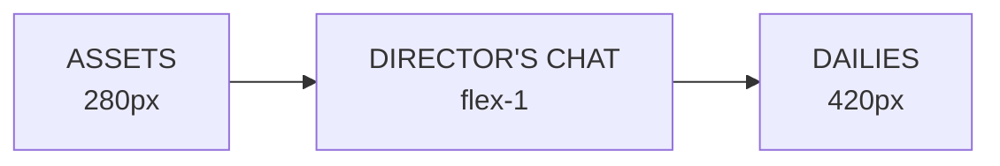

# Director's Chair — Frontend Build Prompt

> **Role:** Elite Frontend/UI Engineer and Designer  
> **Specialty:** Next.js 14+, Tailwind CSS, Framer Motion, cinematic UI  
> **Goal:** Build a complete, runnable, Awwwards-caliber frontend for Director's Chair.

---

## 1. Persona

Act as a **Senior Product Designer + Frontend Architect** who has shipped high-end creative tools (think Linear, Figma, DaVinci Resolve). You obsess over:

- Pixel-perfect typography
- Subtle glassmorphism and depth
- Glowing, purposeful accents
- Buttery-smooth motion
- Information density without clutter

The UI must feel like a **premium cinematic control deck** — not a SaaS dashboard, not a chatbot clone.

---

## 2. Context

**Product:** Director's Chair — a conversational, multi-shot video-generation studio.

**Core metaphor:** The user is a film director sitting on set. Gemini Omni Flash is the cast and crew. Every user message is a direction; every AI response is a take; every shot is a scene in the dailies reel.

**Target audience:** Hackathon judges evaluating Google's Gemini/Omni/NB2 stack.

**Viewport:** Desktop-first, strictly 100vh × 100vw shell with no global scrolling. All scrolling is panel-contained.

**Full product scope:** This is no longer a single-screen demo. Build a complete app with:
- Landing page
- Authentication (login/signup + onboarding)
- Dashboard
- Projects grid with folders
- Project editor (the 3-panel Director's Chair control deck)
- Timeline video editor (VN / Clipchamp parity)
- Asset library with folders
- Settings
- Gemini/ChatGPT-style full chat mode
- Light and dark themes

---

## 2A. Hackathon Judging Rubric & Strategy

The frontend must win across four judging criteria. Optimize every component for these weights:

| Criterion | Weight | How the UI wins |
|---|---|---|
| **Creativity & Originality** | **35%** | Film-set metaphor, AI Animatic Storyboard, "UI is the demo" philosophy. Avoid ChatGPT clone at all costs. |
| **Live Demo** | 25% | Cinematic motion, live animatic cards, clapperboard transitions, voice waveform. Judges should say "wow" in 10 seconds. |
| **Impact in India** | 25% | Local Agent for low-connectivity regions, vernacular voice direction, affordable NB2→Omni pipeline, demos for Indian creators/education. |
| **Technical Depth** | 15% | Context lineage graph, provider abstraction, multi-modal orchestration, non-destructive edit pipeline. |

### India Impact Angle (build this into the demo)

India-specific value propositions to surface in the UI:

1. **Low-bandwidth / offline creation**
   - Promote the Gemma 4 Local Agent toggle as "Works on flaky networks."
   - Show agent state: "Offline ready ✓"
   - Demo scenario: field journalist in rural India planning a video report without cloud.

2. **Vernacular voice direction**
   - Voice input is not just a feature — it removes the English-keyboard barrier.
   - Add a language indicator near the voice button.
   - Demo scenario: director gives instructions in Hindi/Tamil/etc.; system transcribes and acts.

3. **Affordable production pipeline**
   - NB2 Lite generates assets fast and cheap; Omni Flash animates them.
   - Surface cost/speed badges: "Generated in 0.8s" / "Lite proxy preview."
   - Demo scenario: indie filmmaker produces a storyboard without a full crew.

4. **Cultural resonance**
   - Use Indian demo content: a Bollywood-style dance sequence, a regional news report, a wedding montage, or a mythology-inspired animation.
   - This makes judges emotionally connect.

5. **Education and skilling**
   - Demo scenario: a teacher creates visual explainers for rural classrooms by talking to the app.

---

## 3. Design System: "Cinematic Noir" + "Daylight Studio"

The product supports two modes:
- **Dark (Noir):** the cinematic control deck — void black, neon accents, glows.
- **Light (Daylight Studio):** the minimalist storyboard room — white panels, subtle shadows, calm accents.

Use Tailwind `darkMode: 'class'` and `dark:` variants. Store preference in `localStorage`, default to system preference.

### Color palette

| Token | Hex | Usage |
|---|---|---|
| `bg-void` | `#07080A` | Deepest background |
| `bg-panel` | `#111318` | Panel surfaces |
| `bg-elevated` | `#1A1E24` | Floating cards, inputs |
| `border-subtle` | `rgba(255,255,255,0.08)` | Dividers, faint borders |
| `border-strong` | `rgba(255,255,255,0.15)` | Hover/active borders |
| `text-primary` | `#F4F6F8` | Headlines, key labels |
| `text-secondary` | `#8A94A6` | Body, metadata |
| `text-muted` | `#525B69` | Disabled, tertiary |
| `accent-cyan` | `#33F5F7` | AI, tags, Omni Flash |
| `accent-gold` | `#F5C542` | Shots, actions, status |
| `accent-teal` | `#45A29E` | User messages, success |
| `accent-amber` | `#FF9F43` | Warnings, temporal edits |
| `accent-rose` | `#FF6B7A` | Errors, destructive |

### Light mode palette

| Token | Hex | Usage |
|---|---|---|
| `bg-void` | `#FAFBFC` | Page background |
| `bg-panel` | `#FFFFFF` | Panel surfaces |
| `bg-elevated` | `#F4F6F8` | Floating cards, inputs |
| `border-subtle` | `rgba(0,0,0,0.08)` | Dividers, faint borders |
| `border-strong` | `rgba(0,0,0,0.15)` | Hover/active borders |
| `text-primary` | `#0F1115` | Headlines, key labels |
| `text-secondary` | `#5A6578` | Body, metadata |
| `text-muted` | `#8E99AB` | Disabled, tertiary |
| `accent-cyan` | `#00A8A8` | AI, tags, Omni Flash |
| `accent-gold` | `#C79A1E` | Shots, actions, status |
| `accent-teal` | `#2E8B87` | User messages, success |
| `accent-amber` | `#E07B1F` | Warnings, temporal edits |
| `accent-rose` | `#E04B5A` | Errors, destructive |

### Typography (via `next/font/google`)

- **Display / headers:** `Space Grotesk` — tight tracking, uppercase labels.
- **Body / UI:** `Inter` — highly legible, neutral.
- **Tags / data / JSON:** `JetBrains Mono` — terminal-style `@tags` and Context Inspector.

### Background

```txt
bg-[radial-gradient(ellipse_at_top,_var(--tw-gradient-stops))] from-[#111318] via-[#0A0B0E] to-[#07080A]
```

Add a subtle **film grain overlay** at ~3% opacity for cinematic texture.

### Global scrollbar

Custom dark minimal scrollbar:
- Thin width
- Muted track
- Cyan thumb on hover

---

## 4. App Routes & Layout Architecture

### Routes

```
/                       → Landing page
/login                  → Login
/signup                 → Signup + onboarding
/dashboard              → Stats + recent projects
/projects               → Project grid with folders
/projects/[id]          → Director's Chair editor (3-panel)
/projects/[id]/edit     → Timeline video editor
/projects/[id]/chat     → Gemini-style full chat mode
/assets                 → Asset library with folders
/settings               → Theme, language, account
```

### Editor Layout

A strict 100vh × 100vw shell with three fixed panels:



### Panel 1 — Assets (Left, 280px)

- Header: "CAST & PROPS" in `Space Grotesk`, 11px, tracking-widest, uppercase, muted.
- Scrollable grid of asset cards.
- Bottom: glass-morphic input to generate new assets.

### Panel 2 — Director's Chat (Center, flex-1)

- Header: title + pulsing "Omni-Flash Connected" status dot + voice/attach buttons.
- Scrollable chat feed grouped into "Takes."
- Floating input island at bottom.

### Panel 3 — Dailies (Right, 420px)

- Header: "DAILIES" + gold "PLAY SEQUENCE" button.
- Scrollable timeline of ShotCards.
- Toggle between **Timeline list** and **AI Animatic Storyboard grid**.
- Storyboard is the default view — judges see motion immediately.

---

## 5. Required Components

Build every component from scratch — no shadcn, Material UI, or Chakra.

### Layout

- `AppShell` — 100vh shell with three panels.
- `AssetPanel`
- `ChatPanel`
- `TimelinePanel`
- `StatusBar` — bottom bar with project name + Local Agent toggle.

### Assets

- `AssetCard` — framed preview with `@tag` pill, source badge, hover glow.
- `AssetGenerateInput` — glass input with tag validation.
- `AssetEmptyState`

### Chat

- `ChatMessage` — user (right, teal glow) and crew (left, clapperboard avatar).
- `ChatInputIsland` — floating rounded input with voice/attach/send.
- `VoiceRecorder` — red-pulsing record button + waveform bars.
- `TagChip` — cyan monospace `@tag` chip.
- `EditModeBanner` — gold sticky banner.

### Timeline / Shots

- `ShotCard` — 16:9 video, version tabs, overlaid badges, Context Inspector accordion.
- `VersionTabs` — Framer Motion `layoutId` sliding indicator.
- `ContextInspector` — expandable JSON call sheet.
- `PhysicsBadge` — always-on cyan glow atom icon.
- `EditTypeBadge` — swap/style/motion/environment/temporal.
- `ContinuityLine` — animated cyan connector between shots.
- `ContinuityScore` — circular score ring.

### AI Animatic Storyboard (Priority Components)

The Animatic Storyboard is the primary visual win. Build it with full polish.

- `AnimaticCard` — full-bleed live-looping video card.
  - Edge-to-edge `<video>` with `muted`, `loop`, `playsInline`.
  - Plays on hover; ambient play for selected + neighbors.
  - Hover/touch scrub through the clip.
  - Overlaid bottom gradient with shot number, version tabs, Physics badge, edit badges.
  - Generating state: scanning laser line + blurred "RENDERING..." text.
  - Selected state: gold left border + subtle scale + shadow.
  - Continuity-linked state: cyan edge glow + animated connector line.
  - Error state: rose border + shake animation + retry button.

- `AnimaticGrid` — responsive masonry-style or CSS grid storyboard.
  - 2-column grid in Dailies panel.
  - `layoutId` transitions when switching between Storyboard and Timeline views.
  - Cards animate into new positions smoothly.

- `AnimaticScrubber` — horizontal scrub preview on hover/drag.
  - Shows current frame position.
  - Updates video `currentTime` as user drags.
  - Subtle cyan progress indicator.

- `ContinuityHeatmap` — edge glow overlay per card.
  - Green glow = fully consistent.
  - Amber glow = context changed.
  - No glow = first shot / isolated.

- `LiveStageCard` — live camera / reference media card at the top of the storyboard.
  - Shows uploaded reference image/video or live camera feed.
  - Used for multi-modal voice direction.
  - Small red "LIVE" pulse indicator when active.

### Full Chat Mode (Gemini/ChatGPT style)

- `ChatSidebar` — thread history.
- `ChatThread` — scrollable message feed.
- `StreamingMessage` — streaming text reveal.
- `SuggestionChips` — quick action chips below crew replies.

### Timeline Video Editor

- `TimelineEditor` — full editor shell.
- `TimelineTrack` — video/audio/text/effects track.
- `TimelineClip` — draggable clip segment.
- `Playhead` — current time indicator.
- `RazorTool` — split clip at playhead.
- `EffectsPanel` — transitions, filters, speed, audio.
- `ExportModal` — resolution, quality, format settings.

### Modals / Overlays

- `TimelinePlayer` — full-screen modal with clapperboard transitions.
- `DiffViewer` — side-by-side before/after comparison.
- `DirectorViewfinder` — NB2 preview grid.
- `AgentStatusCard` — Gemma 4 local agent status.
- `CallSheetExporter` — Markdown export.
- `NewProjectModal` — create from template or blank.
- `NewFolderModal` — create asset/project folder.

---

## 6. Micro-Interactions (Non-Negotiable)

| Interaction | Implementation |
|---|---|
| Button hover | `transition-all duration-150 hover:border-accent-cyan/50` |
| Focus rings | `focus:ring-1 focus:ring-accent-cyan/50` (never default blue) |
| Card hover | `hover:scale-[1.02]` + cyan drop-shadow |
| Generating state | Scanning laser line + blurred "RENDERING..." text |
| New shot | Slide up + fade in from bottom |
| New version tab | `layoutId` sliding gold indicator |
| Play Timeline | Modal spring scale-up from button |
| Edit mode | Gold border pulse on active ShotCard |
| Context Inspector | Smooth height accordion + content fade |
| Voice recording | Red pulsing glow + waveform bars |
| Animatic hover | Card lifts, border glows cyan, loop begins |
| Animatic scrub | Cyan progress dot follows cursor |
| Continuity link | Cyan SVG line draws between cards |
| Live Stage card | Red "LIVE" dot pulses |
| Storyboard ↔ Timeline | Cards animate positions with `layoutId` |

---

## 7. Mock Data & State

Use React state for the demo UI shell. No backend required.

Seed the app with a realistic "Neon Runner" scene:

```ts
const assets = [
  { id: '1', tag: 'hero', type: 'image', source: 'nb2', url: '/demo/hero.png' },
  { id: '2', tag: 'spaceship', type: 'image', source: 'upload', url: '/demo/spaceship.png' },
  { id: '3', tag: 'night_bg', type: 'image', source: 'nb2', url: '/demo/night_bg.png' },
];

const shots = [
  {
    id: 's1',
    turnIndex: 0,
    prompt: '@hero stands on the bridge of the @spaceship, cinematic wide shot, rain.',
    status: 'done',
    versions: [
      { id: 'v1', prompt: 'initial', editType: null, outputVideoUrl: '/demo/shot1.mp4' },
      { id: 'v2', prompt: 'Make it red alert lighting.', editType: 'style', outputVideoUrl: '/demo/shot1_edit.mp4' },
    ],
    contextSummary: {
      references: ['hero', 'spaceship'],
      physicsInstruction: 'Respect real-world physical dynamics...',
      consistencyInstruction: null,
      continuityScore: 100,
    },
  },
  // ...
];
```

Implement mock actions:
- Generate asset → push to assets after delay.
- Send message → push user message, create generating shot, mark done.
- Edit shot → add version.
- Play timeline → open modal with latest versions.

### Demo scenarios to include

1. **Neon Runner** (default) — cyberpunk chase, proves physics + continuity + edits.
2. **Rural Reporter** — Indian journalist creates a video report offline using Local Agent.
3. **Indie Filmmaker** — Bollywood-style dance sequence built with NB2 assets + voice direction.
4. **Teacher's Lesson** — educator creates visual explainers for a classroom by talking.

Provide toggle or quick-start buttons so the demo operator can switch scenes. Add a "Templates" section to the dashboard and projects page so users can create from any scenario.

### Video editor demo clips

Seed the timeline editor with short clips so it looks real immediately:
- `clip1.mp4`, `clip2.mp4`, `clip3.mp4`
- `audio1.mp3`
- Text overlay examples
- Transition examples

Provide a "Demo Edit" button that loads a pre-cut sequence.

---

## 8. Build Order

1. Configure Tailwind (`tailwind.config.ts`) and `globals.css` (fonts, grain, scrollbar, dark mode).
2. Set up `layout.tsx` with fonts and theme provider.
3. Build shared shell: `Sidebar`, `TopBar`, `ThemeToggle`.
4. Build landing, login, signup, onboarding pages.
5. Build dashboard, projects grid, asset library pages.
6. Build `AppShell` and project editor page with 3-panel layout.
7. Build `AssetPanel` + `AssetCard` + `AssetGenerateInput`.
8. Build `ChatPanel` + `ChatMessage` + `ChatInputIsland` + `VoiceRecorder`.
9. Build `TimelinePanel` + `ShotCard` + `VersionTabs` + `ContextInspector`.
10. Build `TimelinePlayer` modal.
11. Build `AnimaticGrid` + `AnimaticCard` + `AnimaticScrubber` + `ContinuityHeatmap` + `LiveStageCard`.
12. Build full chat mode components (`ChatSidebar`, `ChatThread`, `StreamingMessage`).
13. Build timeline video editor (`TimelineEditor`, tracks, clips, playhead, effects, export).
14. Build extras: `DiffViewer`, `DirectorViewfinder`, `AgentStatusCard`, `StatusBar`.
15. Polish: glows, transitions, responsive flex, populate mock data.

---

## 9. Acceptance Criteria

The frontend is done when:

- [ ] App is strictly 100vh × 100vw with no global scroll.
- [ ] Three panels are visually distinct and contain their own scroll.
- [ ] `@tag` pills glow like terminal chips.
- [ ] ShotCards have version tabs with smooth sliding indicator.
- [ ] Context Inspector expands to show formatted JSON context.
- [ ] Generating shots show cinematic laser/RENDERING state.
- [ ] Animatic cards play live muted loops on hover.
- [ ] Play Timeline feels like a premiere.
- [ ] Local Agent toggle and status card are visible and demo-ready.
- [ ] India-impact demo scenarios are accessible and visually distinct.
- [ ] Voice input supports vernacular direction UX (language indicator, waveform).
- [ ] A judge could understand the product from the UI alone.
- [ ] Landing page is visually stunning and explains the product in 10 seconds.
- [ ] Login/signup + onboarding flow works with mock auth.
- [ ] Dashboard shows stats, recent projects, and templates.
- [ ] Projects grid supports folders, search, list/grid toggle.
- [ ] Full Gemini-style chat mode is functional and polished.
- [ ] Timeline video editor supports split, trim, reorder, transitions, text, audio, export.
- [ ] Asset library supports folders, upload, search, filters.
- [ ] Light and dark modes are fully implemented and cohesive.

---

## 10. Output Format

Deliver a complete Next.js 14 frontend, file by file:

### Config / global
1. `tailwind.config.ts`
2. `src/app/globals.css`
3. `src/app/layout.tsx`

### Marketing + auth
4. `src/app/page.tsx` — Landing page
5. `src/app/(auth)/login/page.tsx`
6. `src/app/(auth)/signup/page.tsx`
7. `src/components/auth/OnboardingFlow.tsx`

### App shell
8. `src/components/shell/Sidebar.tsx`
9. `src/components/shell/TopBar.tsx`
10. `src/components/shell/ThemeToggle.tsx`

### Dashboard + projects
11. `src/app/(app)/dashboard/page.tsx`
12. `src/app/(app)/projects/page.tsx`
13. `src/components/dashboard/StatCard.tsx`
14. `src/components/dashboard/RecentProjectGrid.tsx`
15. `src/components/projects/ProjectCard.tsx`
16. `src/components/projects/ProjectListRow.tsx`
17. `src/components/projects/FolderTree.tsx`
18. `src/components/projects/NewProjectModal.tsx`

### Director's Chair editor
19. `src/app/(app)/projects/[id]/page.tsx`
20. `src/components/layout/AppShell.tsx`
6. `src/components/panels/AssetPanel.tsx`
7. `src/components/panels/ChatPanel.tsx`
8. `src/components/panels/TimelinePanel.tsx`
9. `src/components/assets/AssetCard.tsx`
10. `src/components/assets/AssetGenerateInput.tsx`
11. `src/components/chat/ChatMessage.tsx`
12. `src/components/chat/ChatInputIsland.tsx`
13. `src/components/chat/VoiceRecorder.tsx`
14. `src/components/chat/TagChip.tsx`
15. `src/components/timeline/ShotCard.tsx`
16. `src/components/timeline/VersionTabs.tsx`
17. `src/components/timeline/ContextInspector.tsx`
18. `src/components/timeline/PhysicsBadge.tsx`
19. `src/components/timeline/EditTypeBadge.tsx`
20. `src/components/timeline/ContinuityLine.tsx`
21. `src/components/storyboard/AnimaticCard.tsx`
22. `src/components/storyboard/AnimaticGrid.tsx`
23. `src/components/storyboard/AnimaticScrubber.tsx`
24. `src/components/storyboard/ContinuityHeatmap.tsx`
25. `src/components/storyboard/LiveStageCard.tsx`
26. `src/components/modals/TimelinePlayer.tsx`
27. `src/components/modals/DiffViewer.tsx`
28. `src/components/modals/DirectorViewfinder.tsx`
29. `src/components/agent/AgentStatusCard.tsx`
30. `src/components/agent/LocalAgentToggle.tsx`

### Full chat mode
31. `src/app/(app)/projects/[id]/chat/page.tsx`
32. `src/components/chat/ChatSidebar.tsx`
33. `src/components/chat/ChatThread.tsx`
34. `src/components/chat/StreamingMessage.tsx`
35. `src/components/chat/SuggestionChips.tsx`

### Timeline video editor
36. `src/app/(app)/projects/[id]/edit/page.tsx`
37. `src/components/timeline/TimelineEditor.tsx`
38. `src/components/timeline/TimelineTrack.tsx`
39. `src/components/timeline/TimelineClip.tsx`
40. `src/components/timeline/Playhead.tsx`
41. `src/components/timeline/RazorTool.tsx`
42. `src/components/timeline/EffectsPanel.tsx`
43. `src/components/timeline/ExportModal.tsx`

### Asset library
44. `src/app/(app)/assets/page.tsx`
45. `src/components/assets/AssetGrid.tsx`
46. `src/components/assets/AssetFolderCard.tsx`
47. `src/components/assets/UploadDropzone.tsx`

### Data + utils
48. `src/lib/mock-data.ts`
49. `src/lib/utils.ts` (cn helper with clsx + tailwind-merge)
50. `src/lib/theme-provider.tsx`

Use TypeScript everywhere. Use Framer Motion for all motion. Use Lucide React for icons.

---

## 12. Engineering Notes

### State Management

Use **Zustand** for global state. Split into focused stores:

- `useAuthStore` — user, session, onboarding step.
- `useProjectStore` — projects, folders, active project.
- `useEditorStore` — assets, shots, messages, active shot, Local Agent.
- `useChatStore` — full chat threads, streaming state.
- `useTimelineStore` — timeline clips, playhead, selected clip, export settings.
- `useThemeStore` — light/dark/system preference.

```ts
interface DirectorStore {
  assets: Asset[];
  shots: Shot[];
  messages: Message[];
  activeShotId: string | null;
  isLocalAgent: boolean;
  demoScenario: 'neon-runner' | 'rural-reporter' | 'indie-filmmaker' | 'teachers-lesson';
  voiceLanguage: string;
  activeTab: 'editor' | 'chat' | 'timeline';
  setActiveShot: (id: string | null) => void;
  toggleLocalAgent: () => void;
  sendMessage: (text: string) => void;
  loadScenario: (key: DemoScenario) => void;
  setActiveTab: (tab: 'editor' | 'chat' | 'timeline') => void;
}
```

### Theme Provider

Use a `ThemeProvider` that:
- Reads `localStorage` preference on mount.
- Falls back to `prefers-color-scheme`.
- Applies `dark` class to `<html>`.
- Exposes `theme`, `setTheme`, `toggleTheme`.

- Keep UI-local state (modals, hover, scrub position) inside components.
- Avoid prop drilling across the three panels.

### Asset Stubs

The first run must look complete. Provide a script or seed generator that writes placeholder assets into `/public/demo/`:

- `hero.png`, `spaceship.png`, `night_bg.png`
- `shot1.mp4`, `shot1_edit.mp4`, `shot2.mp4`, `shot3.mp4`

If no real videos exist, generate 3-second colored-noise or gradient-loop MP4/WebM files and label them clearly as placeholders in the UI (`Proxy Preview` badge).

### Video Performance

The Animatic Grid can render many `<video>` elements at once. Prevent GPU meltdown:

- Pause off-screen videos with an Intersection Observer.
- Use `preload="metadata"` by default; switch to `auto` on hover/select.
- Always provide `poster` frames (first frame image or generated thumbnail).
- Limit concurrent ambient playback to the selected card + immediate neighbors (max 3).
- Use `playsInline muted loop` on every video.

### Camera / Live Stage

For the `LiveStageCard` camera preview:

- Use `navigator.mediaDevices.getUserMedia({ video: true })`.
- Show a permission-prompt state and a manual "Enable Camera" button — do not auto-request on mount.
- Provide a fallback upload button if permission is denied.
- Stop the stream when the card unmounts or the modal closes to release the camera.

### Keyboard Shortcuts

Add cinematic keyboard shortcuts to impress judges during the live demo:

| Key | Action |
|---|---|
| `Space` | Play / pause the active timeline |
| `E` | Toggle edit mode on selected shot |
| `V` | Toggle voice input |
| `Cmd/Ctrl + K` | Open scenario switcher / command palette |
| `Esc` | Close modals |
| `← / →` | Navigate shots in storyboard |

Implement via a single `useKeyboardShortcuts` hook attached to `AppShell`.

### Accessibility & Motion

- Respect `prefers-reduced-motion`: disable spring transitions, hover scale, and auto-playing ambient loops.
- Add `aria-label` to icon-only buttons and shot cards.
- Ensure focus rings use the cyan accent, never browser default blue.
- Trap focus inside modals while open.

---

## 13. Gemma 4 Local-First Agent (Special Prize)

> **Target:** Best Use of Gemma 4 — Local-First Agents on Gemma  
> **Core principle:** The agent is a loop, not a straight arrow.

### 13.1 Sense → Decide → Act → Check

Every user direction triggers a closed on-device loop:

- **Sense** — voice/text input, `@tag` mentions, network status, camera feed, last action result.
- **Decide** — classify intent, choose edit type, resolve tags, decide cloud vs local, detect ambiguity.
- **Act** — update shot plan, generate proxy preview, rewrite prompt, queue cloud render.
- **Check** — validate continuity, generation quality, confidence, plan consistency.

If a check fails, loop back to **Decide** with error context.

### 13.2 Local state schema

Store in Zustand + IndexedDB:

```ts
interface LocalAgentState {
  mode: 'cloud' | 'local' | 'auto';
  network: 'online' | 'offline' | 'metered';
  plan: { shots: Shot[]; activeShotId: string | null; versionCounter: number };
  queue: { id: string; type: 'generate' | 'render' | 'sync'; retries: number; status: string }[];
  decisions: { timestamp: number; sense: string; decision: string; action: string; result: string }[];
  deferrals: { id: string; question: string; options: string[]; context: unknown }[];
}
```

### 13.3 Human-defer boundaries

Pause and ask the user when:

- Intent confidence < 60%.
- Ambiguous edit type (e.g., "faster" = speed vs duration).
- Missing critical asset.
- Command conflicts with continuity.
- Two local retries fail.

Deferral UI:

```
┌─ LOCAL AGENT NEEDS INPUT ─┐
│ You said: "make it faster" │
│ Did you mean:              │
│ [Increase motion speed]    │
│ [Shorten clip duration]    │
└────────────────────────────┘
```

### 13.4 Local error recovery

| Failure | Recovery |
|---|---|
| Proxy render failed | Rewrite prompt with stronger tags, retry up to 2x |
| Tag unresolved | Suggest closest local asset, ask user |
| Continuity broken | Highlight conflict, propose fix shot |
| Plan inconsistent | Reorder or insert bridging shot |
| Out of storage | Evict oldest proxies, keep metadata |

### 13.5 UI components

- `LocalAgentToggle` — Cloud / Local switch with offline status.
- `AgentStatusCard` — state, plan, queue, offline ready.
- `AgentLoopVisualizer` — animated Sense → Decide → Act → Check indicator.
- `AgentDecisionLog` — terminal-style recent decisions.
- `HumanDeferDialog` — asks user for clarification.
- `OfflineQueuePanel` — pending sync actions.

### 13.6 Demo flow

1. Toggle Local Agent on.
2. Disconnect network.
3. Plan 3-shot report by voice.
4. Generate shot from local asset.
5. Trigger ambiguity ("make it faster") → defer.
6. Trigger recovery ("add crowd") → retry succeeds.
7. Save everything offline.

### 13.7 Mock provider

If real Gemma 4 on-device inference is unavailable, use a mock provider that follows the same loop, triggers planned deferrals, simulates retries, and is togglable off later.

### 13.8 Acceptance criteria

- [ ] User can toggle Local Agent mode on/off.
- [ ] Agent parses input and updates shot plan without cloud.
- [ ] Agent resolves `@tags` against local assets.
- [ ] Agent shows live sense-decide-act-check loop in the UI.
- [ ] Agent defers to human when confidence is low.
- [ ] Agent recovers from failed generation by rewriting and retrying.
- [ ] Agent state persists across reloads.
- [ ] Offline queue visible and syncs on reconnect.
- [ ] Demo can run entirely offline using mock provider.

---

## 11. Final Directive

> The UI itself should win the hackathon. A judge looking at a screenshot should believe this product is real, polished, and award-worthy before hearing a single word of pitch.

Build it like you are designing the control room for the next Blade Runner.
